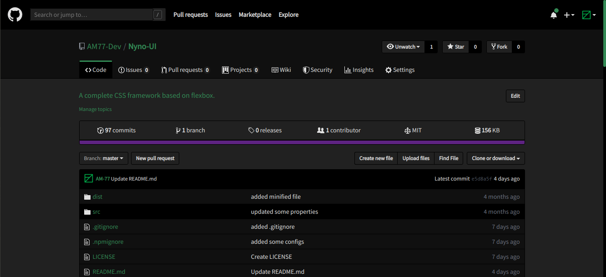

# Dark Github

A dark theme for the github website.

## How to use

Install a userstyle manager for your favorite browser:

- <b>Google Chrome</b>: [Stylus](https://chrome.google.com/webstore/detail/stylus/clngdbkpkpeebahjckkjfobafhncgmne?hl=en)
- <b>Firefox </b>: [Stylus](https://addons.mozilla.org/en-US/firefox/addon/styl-us/)
- <b>Safari</b>: [Cascadea](https://cascadea.app/)

<i>You can use any userstyle manager you like.<i>

Visit [this page](https://raw.githubusercontent.com/AM-77/dark-github-theme/master/dark-github.css) to automatically install the theme.

## Bug reports

To report or fix a bug, please open an issue or submit a pull request.

## License and copyright

Licensed under [MIT](LICENSE) and copyright [AM-77](https://github.com/AM-77).
